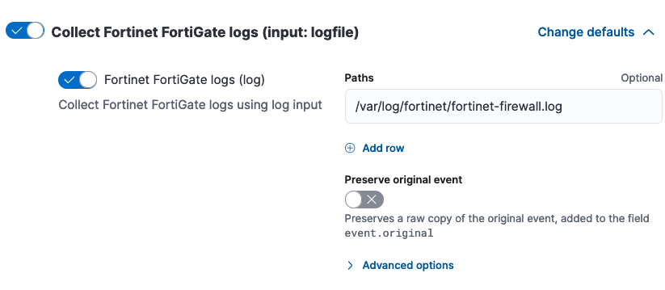
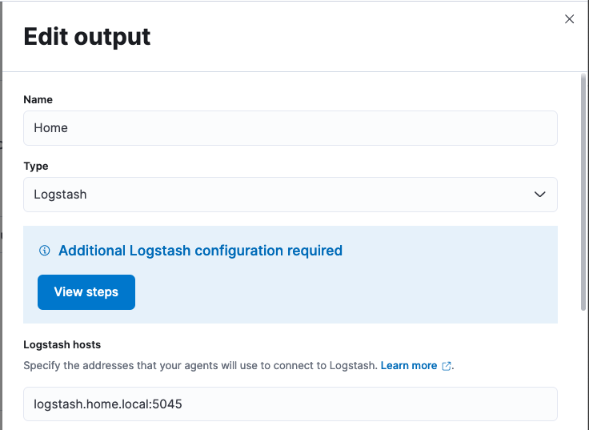
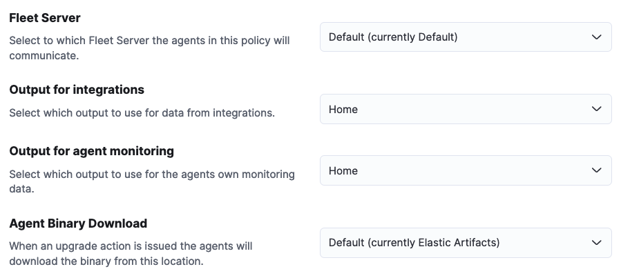
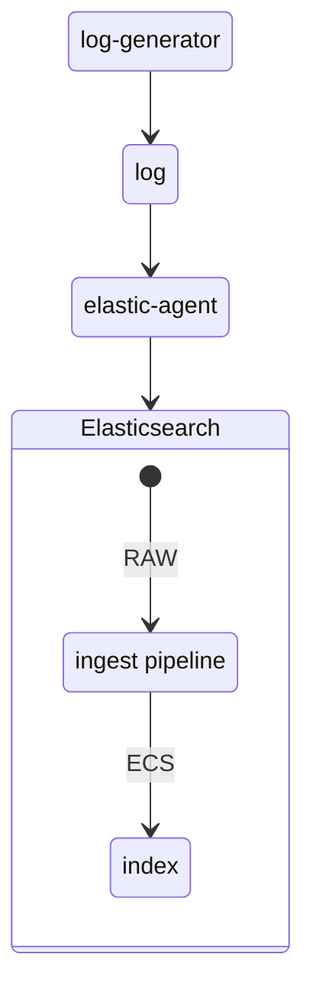
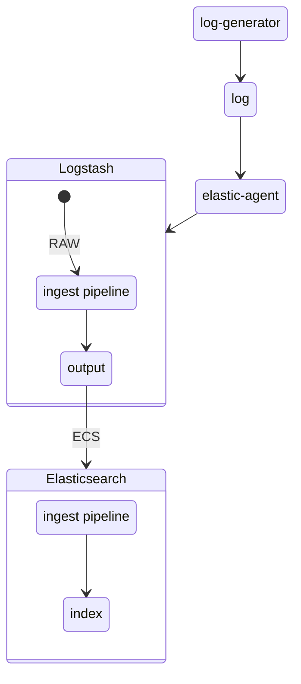
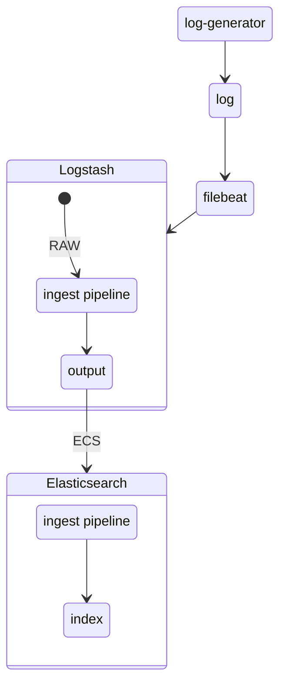

# Logstash integration filter pipeline - Demo

## Overview

In this example we are going to simulate Fortinet Firewall logs and ingest it using Elastic Native [integration](https://docs.elastic.co/en/integrations/fortinet#firewall). To measure the impact on the performances, we are going to look at the ressources saved by moving the ingest pipeline from Elasticsearch to Logstash.

## Requirements

### Logstash > 8.13

Install Logstash using the official [documentation](https://www.elastic.co/guide/en/logstash/current/installing-logstash.html)

### (optional) Centralize Pipeline Configuration

Optional logstash configuration to benefit from elastic [central piepline management](https://www.elastic.co/guide/en/logstash/current/configuring-centralized-pipelines.html). Upon criteria's, each logstash will intherit of their piepline configuration configured in Kibana. This scenario is very usefull if you have to scale your ingestion or deploy and scale your logstash stack through ECK without having the burden to confiure each one of them.

In you logstash configuration, look after X-Pack Management section to reflect your elastic environment. For Example :

```bash
# X-Pack Management
xpack.management.enabled: true
xpack.management.pipeline.id: ["*"]
xpack.management.elasticsearch.cloud_id: "<cloud_id>"
xpack.management.elasticsearch.api_key : "<cloud_api_key>"
```

and then restart your logstash

```bash
systemctl restart logstash
```

You can look after your logs if the configuration is well applied

```bash
journalctl -f -xu logstash
```

### Elastic-agent

#### Elastic-agent deployed and registered to your elastic instance

Install elastic-agent using the official [documentation](https://www.elastic.co/guide/en/fleet/current/install-fleet-managed-elastic-agent.html)

#### Fortinet integration installed and configured to read log input

Once registered, you can configure your respective policy to add [Fortinet Firewall integration ](https://docs.elastic.co/en/integrations/fortinet#firewall) and configure it to read from the input you've selected. Below an example with log input.




#### Configure elastic-agent output

In order to showcase logstash integration pipeline capabilities, we are going to configure elastic-agent policy output to point to our logstash. 
First you need to create a new output in your fleet configuration. For this you'll need to go to _Fleet -> Settings -> Outputs -> Add Output_ and fill up the configuration. For ex :



Once created you'll need to configure your agent policy to use the recently created output. For this you'll need to go to _Fleet -> Agent policies -> "YOUR AGENT POLICY" -> Settings -> Fleet Server_ and modify according to your settings. For ex. 



### Filebeat

While you may want to switch over to elastic-agent it may happen you want to keep your existing ingestion architecture running on top of filebeat

#### Filebeat deployed

Install filebeat using the official [documentation](https://www.elastic.co/guide/en/beats/filebeat/current/filebeat-installation-configuration.html)

#### Fortinet integration installed and configured to read log input

Once installed, you can add [Fortinet Firewall integration ](https://docs.elastic.co/en/integrations/fortinet#firewall) assets by going to -> _Integrations -> Fortinet FortiGate Firewall Logs -> Settings -> Install Fortinet FortiGate Firewall Logs assets_

This will install all the assets from the integrations including the ingest pipeline.

#### Configure filebeat

In order to showcase logstash integration pipeline capabilities, we are going to configure filebeat to point to our logstash and use the fortinet integration pipeline.
For this you can use the following configuration snippet :

```bash
filebeat.inputs:
- type: filestream
  enabled: true 
  id: fortinet-firewall
  paths:
    - /var/log/fortinet/fortinet-firewall-filebeat.log

output.logstash:
  hosts: ["logstash.home.local:5044"]
```

and restart filebeat

```bash
systemctl restart filebeat
```

### (optional) Elastic-agent Logstash Integration

If you want to look after the impact on the logstash, you can install logstash [elastic-agent integration](https://docs.elastic.co/integrations/logstash) and configure it as per your environment

## Elasticsearch Ingest Pipeline

Below the overall demo ingestion piepline:



### Logstash pipeline Creation

First we are going to create a straight path from our log-generator to logstash were the parsing will be exectued on elasticsearch side. Go to _Stack Management -> Logstash Pipelines -> Create Pipeline_ and paste the following code on your newly created pipeline:

```bash
input {
  elastic_agent {
    port => 5045
  }
}

output {
  elasticsearch {
    hosts => "<cloud_endpoint>"
    api_key => "<cloud_api_key>" # logstash encoded format
    data_stream => true
    ssl => true
  }
}
```

### Generation and Data validation

Start generating data using _[log-generator](https://github.com/fred-maussion/log-generator)_ and the yml pipeline located under the _log-generator/conf/patterns_ folder of this repository:

```bash
docker run -v `pwd`/conf/:/root/.config/rlog_generator/ -v `pwd`/logs:/logs/ ghcr.io/fred-maussion/log-generator:develop
```

Go to Fortinet Dashboard and validate data is well parsed and coming in.

## Elastic-agent - Logstash Ingest Pipeline

Now we are going to move from elasticsearch pipeline execution to logstash pipeline. Below the overall logstash demo ingestion piepline:



### Elastic-agent - Logstash Integration Pipeline Creation

```bash
input {
  elastic_agent {
    port => 5045
  }
}

filter {
  elastic_integration{ 
    cloud_id => "<cloud_id>"
    api_key => "<cloud_api_key>" # base64 encoded format
  }
}

output {
  elasticsearch {
    hosts => "<cloud_endpoint>"
    api_key => "<cloud_api_key>" # logstash encoded format
    data_stream => true
    ssl => true
  }
}
```

### Elastic-agent - Generation and validation

Start generating data using _[log-generator](https://github.com/fred-maussion/log-generator)_ and the yml pipeline located under the _log-generator/conf/patterns_ folder of this repository:

```bash
docker run -v `pwd`/conf/:/root/.config/rlog_generator/ -v `pwd`/logs:/logs/ ghcr.io/fred-maussion/log-generator:develop
```

## Filebeat - Logstash Ingest Pipeline

Now we are going to move from elasticsearch pipeline execution to logstash pipeline. Below the overall logstash demo ingestion piepline:



### Filebeat - Logstash Integration Pipeline Creation

```bash
input {
  beats {
    port => 5044
  }
}

filter {
  elastic_integration{ 
    cloud_id => "<cloud_id>"
    api_key => "<cloud_api_key>" # base64 encoded format
  }
}

output {
  elasticsearch {
    hosts => "<cloud_endpoint>"
    api_key => "<cloud_api_key>" # logstash encoded format
    data_stream => true
    data_stream_dataset => "fortinet_fortigate.log"
    data_stream_type => "logs"
    ssl => true
  }
}
```

### Filebeat - Generation and validation

Start generating data using _[log-generator](https://github.com/fred-maussion/log-generator)_ and the yml pipeline located under the _log-generator/conf/patterns_ folder of this repository:

```bash
docker run -v `pwd`/conf/:/root/.config/rlog_generator/ -v `pwd`/logs:/logs/ ghcr.io/fred-maussion/log-generator:develop
```